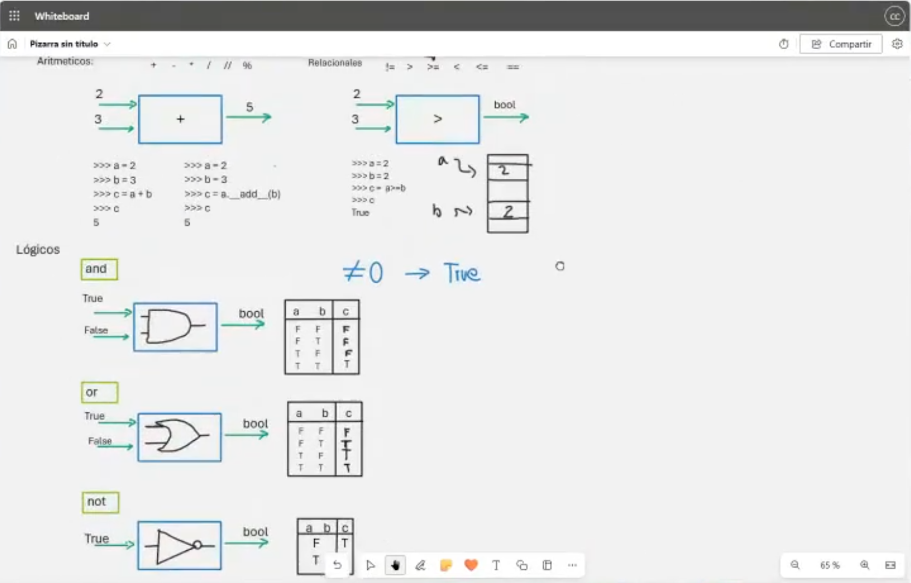
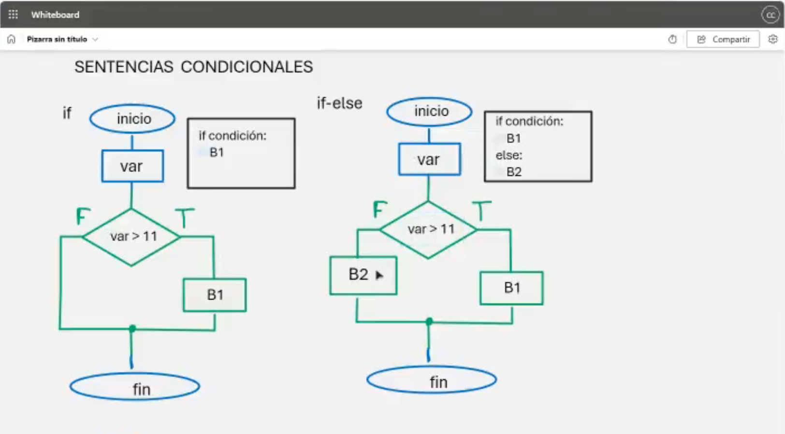
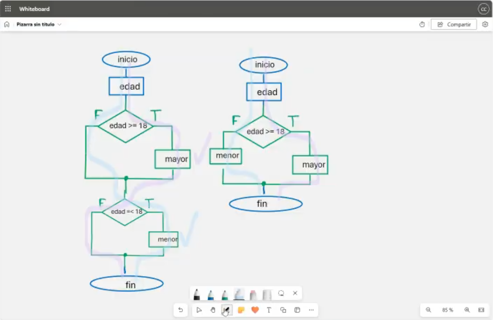
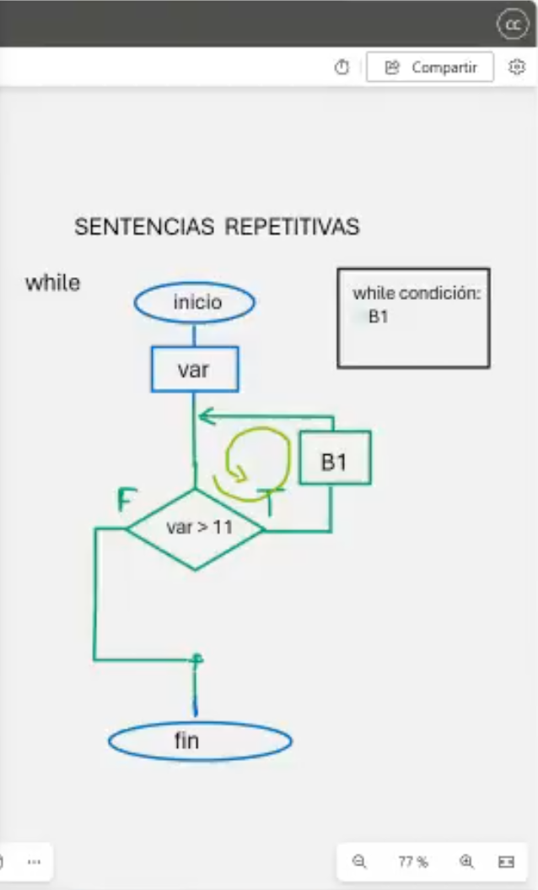

# Clase 7: Operadores Lógicos, Sentencias Condicionales y Sentencias Repetitivas

## Descripción

En esta clase exploraremos los **operadores lógicos**, las **sentencias condicionales** y las **sentencias repetitivas** en Python. Estos conceptos son esenciales para la toma de decisiones y la ejecución repetitiva de bloques de código.

---

## 🔢 Operadores Lógicos

Los **operadores lógicos** permiten realizar operaciones booleanas en Python. Son fundamentales en la evaluación de condiciones en estructuras de control.

### 🔎 Operadores disponibles:
- **`and`**: Devuelve `True` si ambas condiciones son verdaderas.
- **`or`**: Devuelve `True` si al menos una de las condiciones es verdadera.
- **`not`**: Invierte el valor de una expresión booleana.



### Ejemplo:
```python
x = True
y = False

print(x and y)  # False
print(x or y)   # True
print(not x)    # False
```

---

## ⚖️ Sentencias Condicionales

Las **sentencias condicionales** permiten ejecutar diferentes bloques de código en función de si una condición es verdadera o falsa.

### 🔍 Tipos de condicionales:
- `if`: Evalúa una condición y ejecuta un bloque de código si es verdadera.
- `if-else`: Proporciona una alternativa en caso de que la condición sea falsa.
- `if-elif-else`: Permite evaluar múltiples condiciones.



### Ejemplo:
```python
nota = int(input("Ingrese su nota: "))
if nota >= 11:
    print("Aprobado")
else:
    print("Desaprobado")
```

---

## ⟲ Sentencias Repetitivas

Las **sentencias repetitivas** permiten ejecutar un bloque de código varias veces mientras se cumpla una condición.

### 🎯 Tipos de sentencias repetitivas:
- `while`: Ejecuta un bloque de código mientras una condición sea verdadera.
- `for`: Itera sobre una secuencia de elementos.



### Ejemplo:
```python
contador = 0
while contador < 5:
    print("Iteración", contador)
    contador += 1
```

---

## 📚 Resumen Visual

A continuación, se presenta una vista general de los conceptos abordados en esta clase.



---

## Sobre el Autor
- **Nombre:** Edwin Yoner
- **Correo:** [edwinyoner@gmail.com](mailto:edwinyoner@gmail.com)
- **LinkedIn:** [linkedin.com/in/edwinyoner](https://www.linkedin.com/in/edwinyoner)