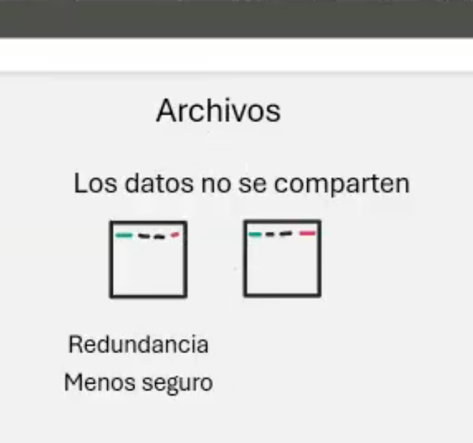
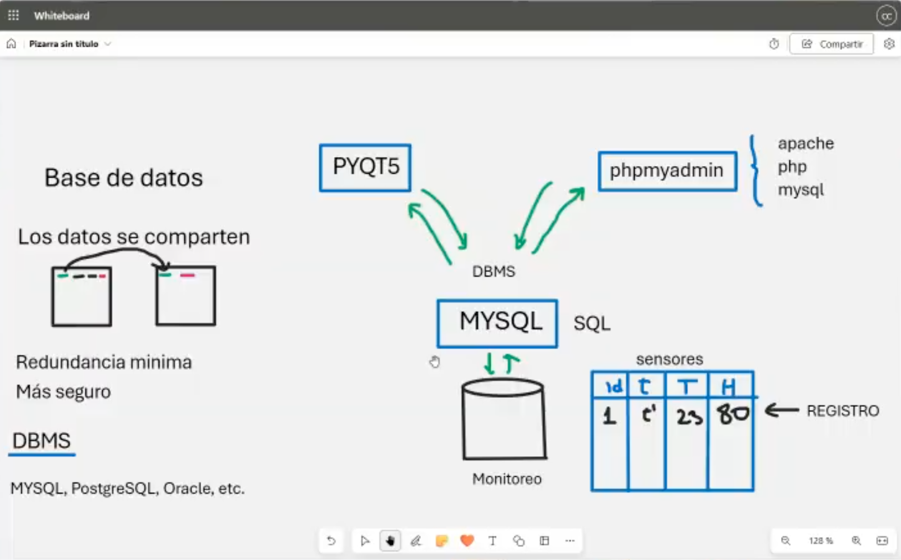
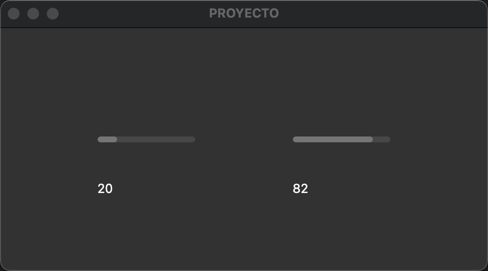

# Clase 19: Interfaz Gráfica, Archivos y Base de Datos

En esta clase veremos **interfaces gráficas con PyQt5, el manejo de archivos para almacenar datos y la conexión con bases de datos como MySQL**.  
Exploraremos las ventajas y desventajas de **almacenar datos en archivos locales frente al uso de bases de datos**, y cómo esto impacta la seguridad y redundancia de la información.  

También veremos cómo visualizar datos en una interfaz gráfica utilizando **PyQt5**, con actualizaciones dinámicas de valores obtenidos desde un archivo de texto o una base de datos.  

Finalmente, realizaremos una **comparación entre el uso de archivos y bases de datos** en sistemas que requieren almacenamiento y procesamiento de datos en tiempo real, como sensores IoT o sistemas de monitoreo.

---

## 📷 Capturas de Pantalla

### **1️⃣ Almacenamiento en Archivos**
Los datos **no se comparten**, lo que genera **redundancia** y menor seguridad.

---

### **2️⃣ Uso de Base de Datos**
Los datos **se comparten** entre múltiples aplicaciones, reduciendo **redundancia** y aumentando la **seguridad**.

---

### **3️⃣ Interfaz Gráfica con Lectura de Datos**
Interfaz gráfica creada con **PyQt5** para mostrar datos en tiempo real desde un archivo o base de datos.

---

## 📌 Contenido

1. **Comparación entre almacenamiento en archivos y bases de datos**  
   - Diferencias entre almacenar datos en **archivos locales** vs. **bases de datos relacionales**.
   - Conceptos de **redundancia, seguridad y acceso a datos**.
   - Uso de **DBMS** como MySQL, PostgreSQL y Oracle.

2. **Manejo de Archivos (`datos.txt`)**  
   - Escritura y lectura de datos en un archivo de texto.
   - Uso de `open()` y `with open()` para la manipulación de archivos.
   - Ejemplo práctico con **datos de sensores** en archivos `.txt`.

3. **Integración de Base de Datos con PyQt5**  
   - Configuración y conexión de una base de datos MySQL con una interfaz gráfica.
   - Inserción, consulta y actualización de datos desde MySQL a la GUI.
   - Uso de **phpMyAdmin** para administración de bases de datos.

4. **Visualización de Datos en Tiempo Real**  
   - Implementación de **QProgressBar** para representar valores dinámicos.
   - Uso de **QLabel** para mostrar datos de temperatura y humedad.
   - Implementación de **QTimer** para actualizar valores en la interfaz.

---

## 🔧 Requisitos

- **Python 3.6 o superior**.
- **PyQt5** instalado (`pip install PyQt5`).
- **MySQL Server** (opcional, para la parte de base de datos).
- **phpMyAdmin** (opcional, para gestionar MySQL de forma visual).

---

## 👨‍💻 Sobre el Autor

- **👤 Nombre:** Edwin Yoner
- **📧 Contacto:** [✉ edwinyoner@gmail.com](mailto:edwinyoner@gmail.com)
- **🔗 LinkedIn:** [🌐 linkedin.com/in/edwinyoner](https://www.linkedin.com/in/edwinyoner)