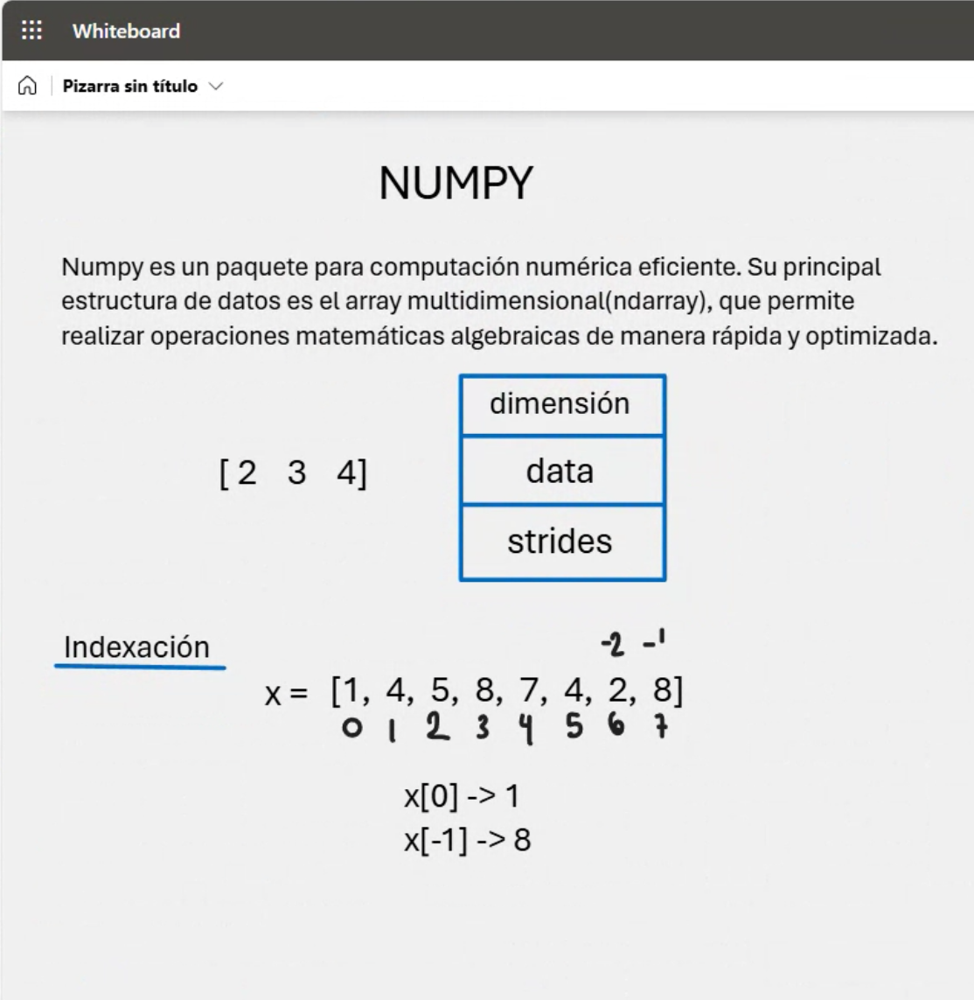
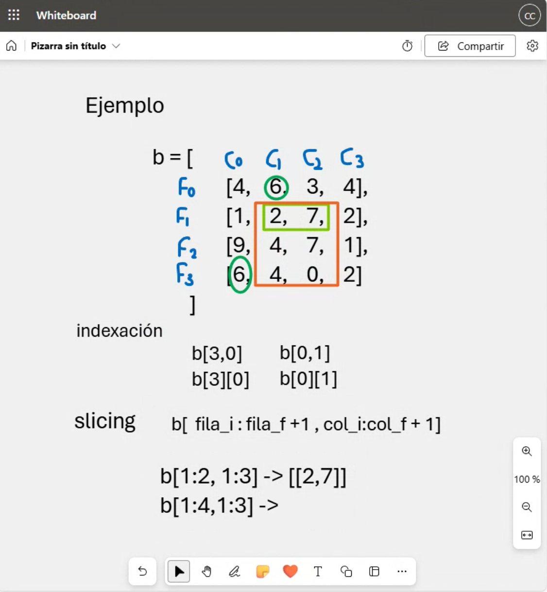
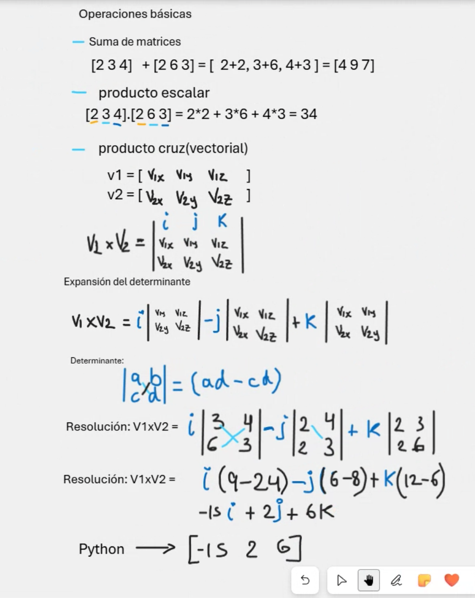

# Clase 21: Introducción a Numpy  

## Introducción  
**Numpy** es una biblioteca fundamental para la computación numérica en Python. Permite manejar grandes volúmenes de datos de manera eficiente mediante **arrays multidimensionales** y operaciones matemáticas optimizadas. En esta clase exploraremos los conceptos básicos, la manipulación de arrays y algunas funciones matemáticas clave.  

## Conceptos Claves  
- **Numpy:** Biblioteca en Python diseñada para el manejo eficiente de datos numéricos.  
- **Array (`ndarray`):** Estructura de datos optimizada para cálculos matemáticos.  
- **Indexación y slicing:** Métodos para acceder y modificar elementos dentro de los arrays.  
- **Operaciones matemáticas:** Suma, resta, producto escalar y funciones avanzadas en Numpy.  

## Creación de Arrays en Numpy  
Para crear un array en Numpy, utilizamos la función `np.array()`, como en el siguiente ejemplo:  

```python
import numpy as np

a = np.array([2, 3, 4])
print(a)
```

📌 **Ejemplo de salida en consola:**  
  

## Indexación y Slicing en Arrays  
Podemos acceder a elementos de un array utilizando índices positivos y negativos:  

```python
x = np.array([1, 4, 5, 8, 7, 4, 2, 8])

print(x[0])   # 1
print(x[-1])  # 8
```

También es posible trabajar con **arrays multidimensionales**:  

```python
b = np.array([
    [4, 6, 3, 4],
    [1, 2, 7, 2],
    [9, 4, 7, 1],
    [6, 4, 0, 2]
])

print(b[3, 0])  # 6
print(b[0, 1])  # 6
```

📌 **Ejemplo visual de indexación:**  
  

## Operaciones Matemáticas en Numpy  
### 🔹 Suma de Arrays  
```python
A = np.array([2, 3, 4])
B = np.array([2, 6, 3])

C = A + B
print(C)  # [4 9 7]
```

### 🔹 Producto Escalar  
```python
resultado = np.dot(A, B)
print(resultado)  # 34
```

### 🔹 Producto Cruz (Vectorial)  
```python
V1 = np.array([3, 6, 4])
V2 = np.array([2, 2, 3])

cruz = np.cross(V1, V2)
print(cruz)  # [-15  2  6]
```

📌 **Ejemplo de operaciones matemáticas en Numpy:**  
  


## Conclusión  
**Numpy** facilita el manejo de datos numéricos y optimiza operaciones matemáticas, lo que lo convierte en una herramienta clave para la ciencia de datos, aprendizaje automático y análisis numérico en Python.  

---

## 👨‍💻 Sobre el Autor

- **👤 Nombre:** Edwin Yoner
- **📧 Contacto:** [✉ edwinyoner@gmail.com](mailto:edwinyoner@gmail.com)
- **🔗 LinkedIn:** [🌐 linkedin.com/in/edwinyoner](https://www.linkedin.com/in/edwinyoner)