# Clase 22: OpenCV

En esta clase exploramos OpenCV, una biblioteca de código abierto especializada en procesamiento digital de imágenes. Aprenderemos conceptos fundamentales y aplicaremos diversas técnicas para analizar y modificar imágenes.

---

## Procesamiento Digital de Imágenes

El procesamiento digital de imágenes es un conjunto de técnicas aplicadas a una imagen digital con el objetivo de mejorar su calidad, extraer información relevante o transformarla para distintos propósitos.

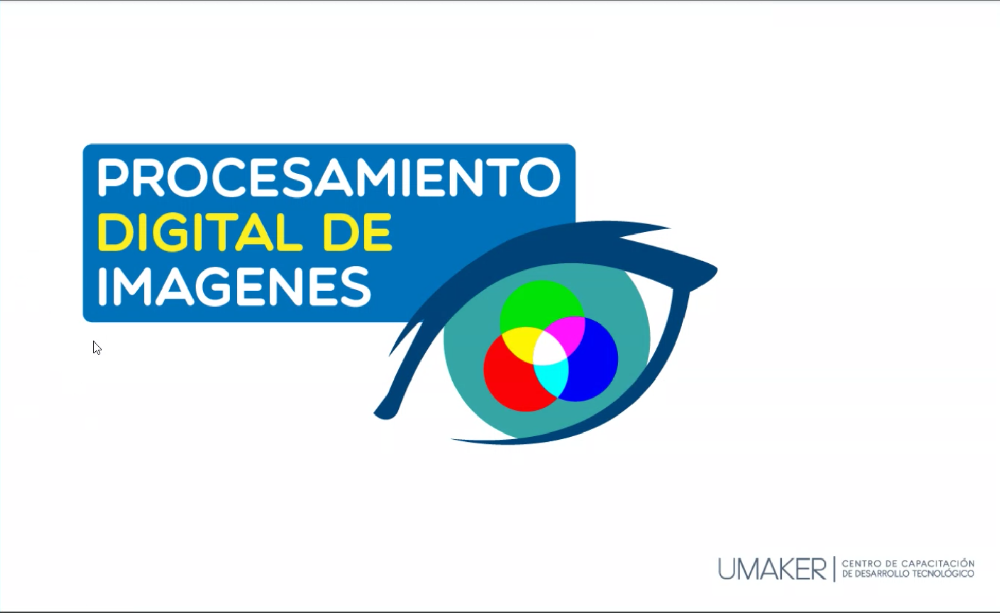

---

## Módulos principales Introducción a NumPy, Matplotlib y OpenCV

### 1. NumPy
**NumPy** (Numerical Python) es una biblioteca de Python diseñada para trabajar con arreglos y matrices multidimensionales.  
Se caracteriza por su eficiencia en cálculos matemáticos avanzados, incluyendo álgebra lineal, transformadas de Fourier y generación de números aleatorios.  
Es fundamental en el ecosistema de ciencia de datos y machine learning debido a su rapidez y facilidad de uso.

### 2. Matplotlib
**Matplotlib** es una biblioteca utilizada para la visualización de datos mediante gráficos.  
Permite crear gráficos de líneas, dispersión, barras, histogramas y más.  
Es ampliamente utilizada en análisis de datos y es compatible con bibliotecas como NumPy y Pandas.

### 3. OpenCV
**OpenCV** (Open Source Computer Vision) es una biblioteca especializada en procesamiento de imágenes y visión por computadora.  
Ofrece herramientas para la manipulación de imágenes, detección de bordes, filtrado, reconocimiento facial y procesamiento de video en tiempo real.  
Es utilizada en proyectos de inteligencia artificial, machine learning y robótica.

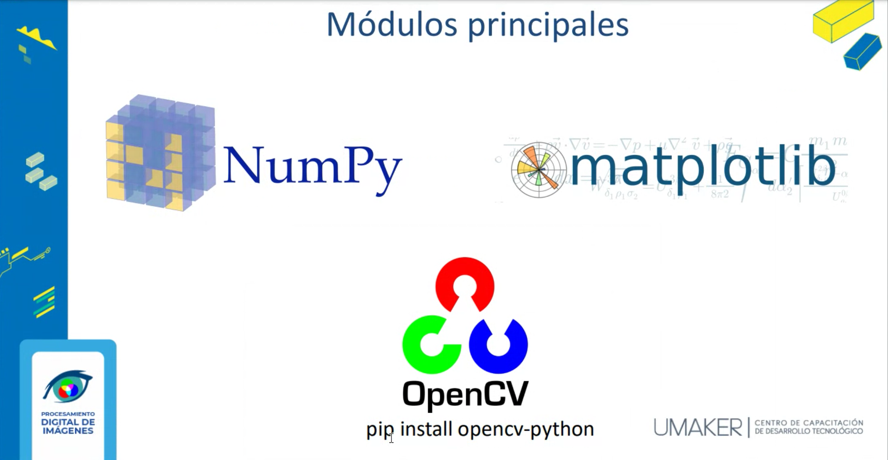

## Introducción a OpenCV

### ¿Qué es OpenCV?
**OpenCV** (Open Source Computer Vision Library) es una biblioteca de código abierto especializada en procesamiento de imágenes y visión por computadora.  
Se utiliza en una amplia gama de aplicaciones, como reconocimiento facial, detección de objetos, análisis de movimiento, y procesamiento de video en tiempo real.

### Características Principales
- **Procesamiento de Imágenes**: Aplicación de filtros, detección de bordes, transformaciones y mejoras de imágenes.
- **Visión por Computadora**: Reconocimiento de patrones, segmentación de imágenes y análisis de movimiento.
- **Soporte para múltiples lenguajes**: Compatible con Python, C++, Java y más.
- **Optimización y rendimiento**: Usa aceleración por hardware (GPU) y está optimizado para operaciones en tiempo real.
- **Integración con otras bibliotecas**: Compatible con NumPy, TensorFlow y otras herramientas de inteligencia artificial.

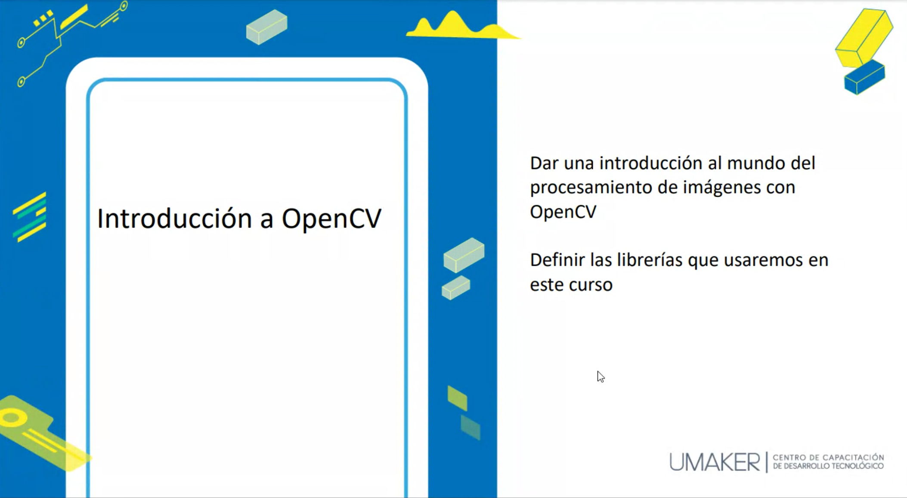
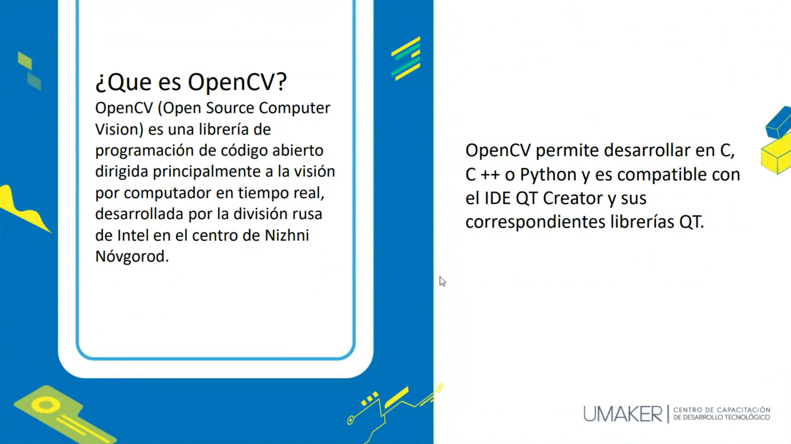

## Áreas de Aplicación de OpenCV

OpenCV es una biblioteca de procesamiento de imágenes y visión por computadora ampliamente utilizada en diversas áreas. Algunas de sus principales aplicaciones incluyen:

- **Procesamiento de Imágenes Médicas**: Detección de anomalías en imágenes de rayos X, resonancias magnéticas y tomografías.
- **Sistemas de Seguridad y Vigilancia**: Reconocimiento facial, detección de movimiento y análisis de comportamiento en video.
- **Automatización Industrial**: Control de calidad mediante inspección visual en líneas de producción.
- **Vehículos Autónomos**: Detección de objetos, reconocimiento de señales de tráfico y navegación autónoma.
- **Realidad Aumentada**: Superposición de elementos digitales sobre el mundo real mediante reconocimiento de patrones.
- **Robótica**: Percepción visual en robots para navegación y manipulación de objetos.
- **Reconocimiento de Caracteres (OCR)**: Conversión de texto en imágenes a formato digital editable.
- **Análisis de Deportes**: Seguimiento de jugadores y análisis de rendimiento en tiempo real.

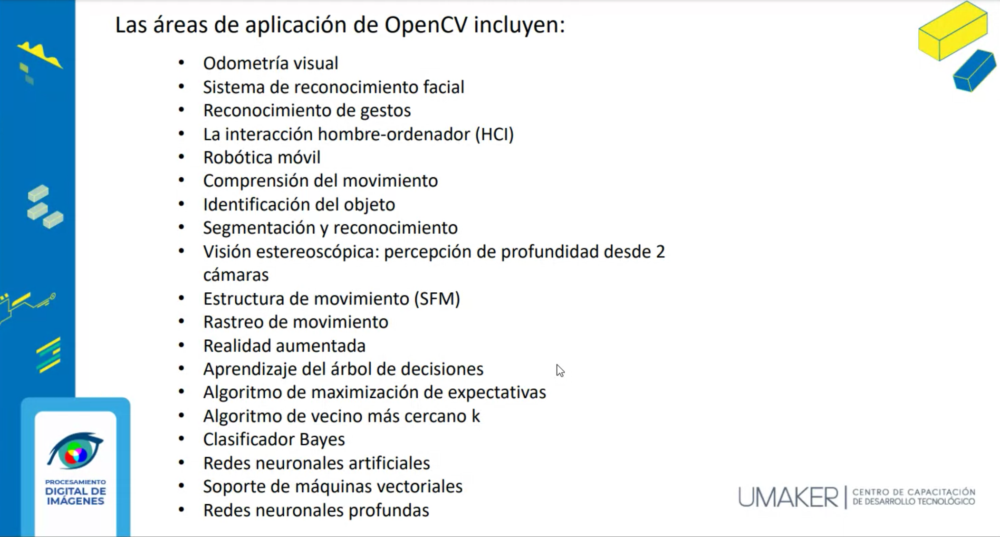
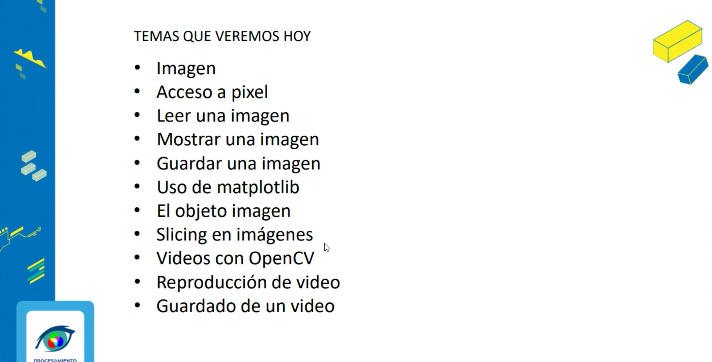

## Imágen

Una **imágen** es una representación visual de un objeto, escena o concepto. En el ámbito digital, una imagen se compone de una matriz de píxeles que contienen información sobre el color y la intensidad de la luz. Dependiendo de su naturaleza y formato, las imágenes pueden clasificarse en diferentes categorías y representaciones.
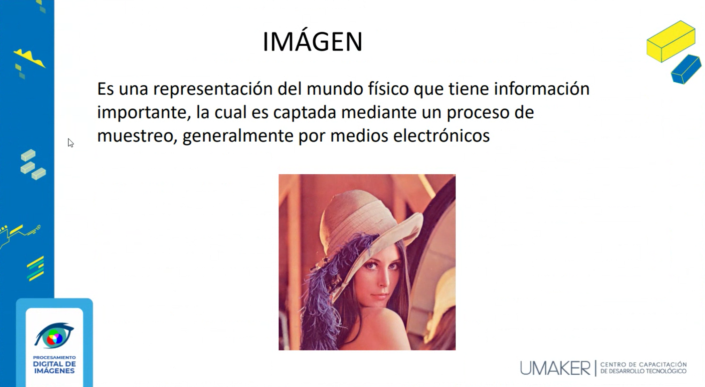

### Píxel

Un **píxel** (abreviatura de "elemento de imagen") es la unidad más pequeña de una imagen digital. Cada píxel tiene un valor asociado que define su color o intensidad. En imágenes en color, un píxel suele estar compuesto por tres valores correspondientes a los canales **Rojo (R), Verde (G) y Azul (B)**.

Propiedades de un píxel:
- **Resolución**: Cantidad total de píxeles en una imagen (Ejemplo: 1920x1080).
- **Profundidad de color**: Cantidad de bits utilizados para representar el color de cada píxel (Ejemplo: 8 bits, 24 bits).

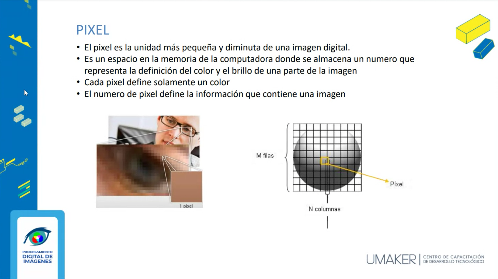

### Clasificación de las Imágenes

Las imágenes digitales se pueden clasificar en dos tipos principales:

#### 1. Imágenes Vectoriales
Las imágenes vectoriales están formadas por figuras geométricas como líneas, curvas y polígonos definidos por ecuaciones matemáticas. Son escalables sin pérdida de calidad y se utilizan en diseño gráfico y animaciones.

- **Ventajas**:
  - No pierden calidad al escalarse.
  - Ocupan menos espacio en algunos casos.
  - Son ideales para ilustraciones y logotipos.
- **Formatos comunes**: SVG, AI, EPS, PDF.

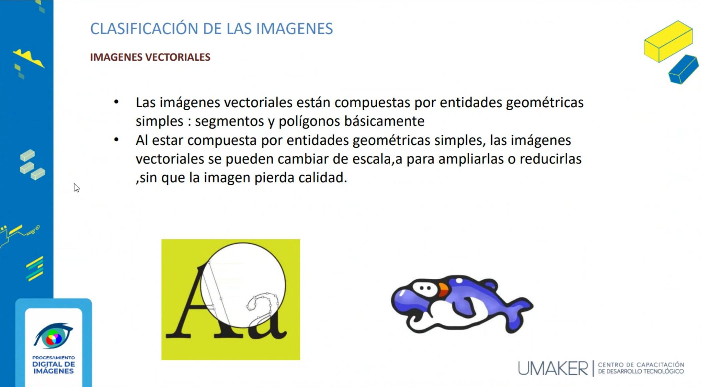

#### 2. Imágenes de Mapa de Bits (Bitmap)
Las imágenes **bitmap** están compuestas por una matriz de píxeles. Su resolución es fija y al escalarlas pueden perder calidad.

- **Ventajas**:
  - Capturan detalles complejos.
  - Son utilizadas en fotografía y diseño digital.
- **Desventajas**:
  - Pierden calidad al aumentar su tamaño.
  - Pueden ocupar más espacio en disco.
- **Formatos comunes**: PNG, JPG, BMP, TIFF.

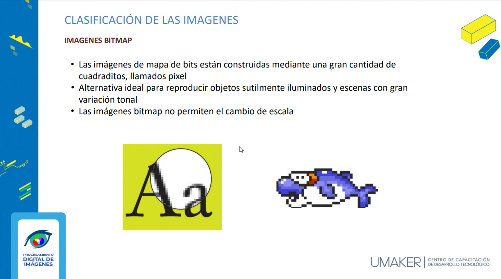

### Formatos de Imágenes (Raster o Bitmap)

Los formatos **raster** o **bitmap** representan imágenes mediante píxeles. Cada formato tiene características específicas:

- **JPG (JPEG)**: Compresión con pérdida, ideal para fotografías.
- **PNG**: Soporta transparencias, compresión sin pérdida.
- **BMP**: Formato sin compresión, alta calidad pero gran tamaño.
- **TIFF**: Alta calidad, usado en impresión y fotografía profesional.
- **GIF**: Soporta animaciones y paleta de colores limitada.


## Espacios de Color

Los espacios de color definen la manera en que los colores son representados en una imagen. Los más utilizados en procesamiento digital son:


### 1. **RGB (Red, Green, Blue)**
El espacio **RGB** es el más común en pantallas y monitores. Cada píxel se representa mediante la combinación de los tres colores primarios (rojo, verde y azul).

- **Usos**: Imágenes digitales, pantallas, diseño web.
- **Valores**: Cada canal puede tener valores de 0 a 255 (8 bits por canal).

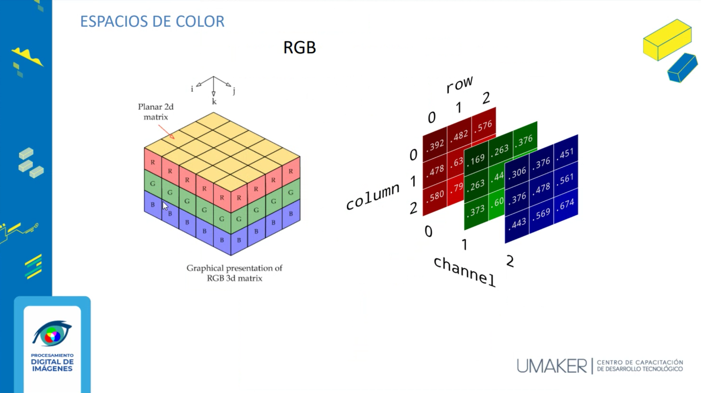

### 2. **Grayscale (Escala de Grises)**
En imágenes en **escala de grises**, cada píxel tiene un solo valor de intensidad que va desde el negro absoluto (0) hasta el blanco absoluto (255).

- **Usos**: Visión por computadora, análisis de imágenes médicas.
- **Ventaja**: Requiere menos espacio de almacenamiento en comparación con RGB.

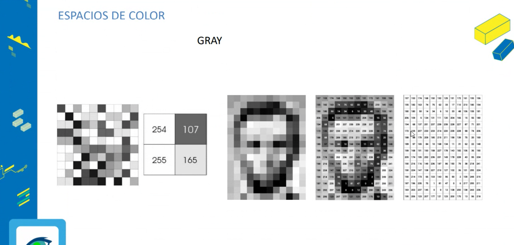

Otros espacios de color incluyen **CMYK** (para impresión), **HSV** (matiz, saturación y valor) y **LAB** (basado en percepción humana del color).

## Procesamiento de Imágenes con OpenCV - Separación de Canales de Color

### Descripción

Este script, **opencv_images.py**, permite cargar una imagen desde el disco y analizar sus canales de color de forma individual utilizando **OpenCV**. Se presentan las siguientes funcionalidades:

- Carga de una imagen en formato **BGR (Azul, Verde, Rojo)**.
- Visualización de los canales de color de manera separada.
- Eliminación progresiva de cada canal de color para observar su impacto en la imagen.

El programa mostrará la imagen original junto con sus canales de color separados y versiones modificadas sin ciertos colores.

### Código

```python
"""
Archivo: opencv_images.py
Autor: Edwin Yoner
Fecha: 01/03/2025

Descripción:
    Este script carga una imagen desde el disco y muestra sus canales de color (BGR) de forma individual.
    - Se carga la imagen usando OpenCV.
    - Se muestran los canales Azul (B), Verde (G) y Rojo (R) por separado.
    - Se eliminan progresivamente los canales de color para observar los efectos.

Requisitos:
    - Instalar OpenCV si no está disponible: `pip install opencv-python`
    - Asegurarse de que la imagen `images/img.png` existe en la ruta especificada.
"""

import numpy as np
import cv2

# Cargar la imagen en formato BGR
ruta_imagen = "images/img.png"
imagen = cv2.imread(ruta_imagen)

# Verificar si la imagen se cargó correctamente
if imagen is None:
    print(f"Error: No se pudo cargar la imagen en '{ruta_imagen}'. Verifica la ruta.")
    exit()

# Mostrar información sobre la imagen
print(f"Dimensiones de la imagen: {imagen.shape}")  # (altura, ancho, canales)

# Mostrar la imagen original
cv2.imshow("Imagen Original", imagen)

# Mostrar los canales de color individualmente
cv2.imshow("Canal Azul (B)", imagen[:, :, 0])
cv2.imshow("Canal Verde (G)", imagen[:, :, 1])
cv2.imshow("Canal Rojo (R)", imagen[:, :, 2])

# Eliminar el canal azul y mostrar la imagen resultante
imagen_sin_azul = imagen.copy()
imagen_sin_azul[:, :, 0] = 0
cv2.imshow("Imagen sin Azul", imagen_sin_azul)

# Eliminar el canal verde y mostrar la imagen resultante
imagen_sin_verde = imagen.copy()
imagen_sin_verde[:, :, 1] = 0
cv2.imshow("Imagen sin Verde", imagen_sin_verde)

# Eliminar el canal rojo y mostrar la imagen resultante
imagen_sin_rojo = imagen.copy()
imagen_sin_rojo[:, :, 2] = 0
cv2.imshow("Imagen sin Rojo", imagen_sin_rojo)

# Esperar a que el usuario presione una tecla antes de cerrar las ventanas
cv2.waitKey(0)
cv2.destroyAllWindows()
```

### Explicación del Código

1. **Carga de la imagen**  
   Se lee la imagen desde la ruta `images/img.png` usando `cv2.imread()`, que devuelve una matriz **NumPy** con los valores de los píxeles.

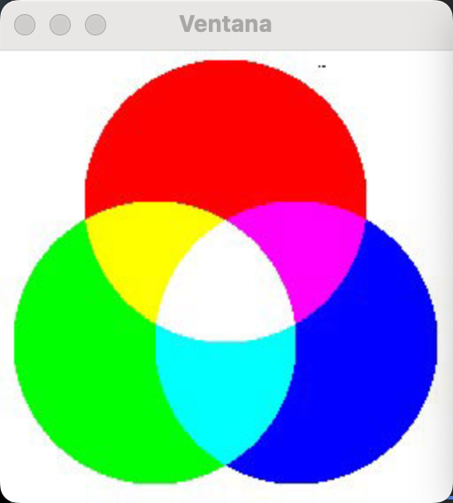   

2. **Visualización de los canales de color**  
   OpenCV almacena las imágenes en formato **BGR** (en lugar de RGB), por lo que los canales se extraen en el siguiente orden:
   - `imagen[:, :, 0]` → Canal **Azul** (B).
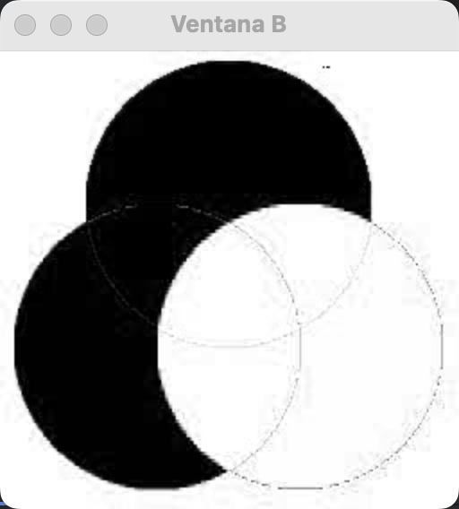
   - `imagen[:, :, 1]` → Canal **Verde** (G).
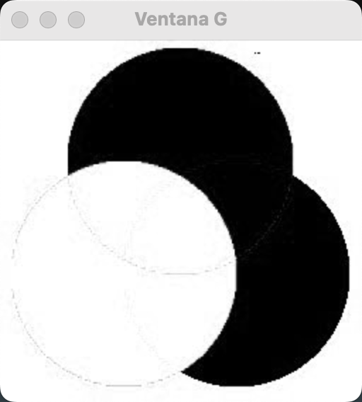
   - `imagen[:, :, 2]` → Canal **Rojo** (R).
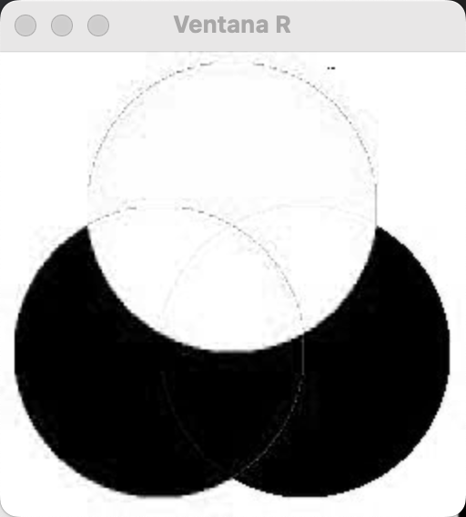

3. **Modificación de los canales de color**  
   Se crean copias de la imagen original y se eliminan progresivamente cada uno de los canales estableciendo su valor en `0`.

4. **Visualización con OpenCV**  
   Las imágenes resultantes se muestran en ventanas individuales utilizando `cv2.imshow()`. El programa espera una tecla antes de cerrarlas con `cv2.waitKey(0)`.

## Conclusión
En esta clase, exploramos OpenCV como una herramienta poderosa para el procesamiento digital de imágenes y la visión por computadora. Aprendimos los conceptos fundamentales de imágenes digitales, incluyendo su representación mediante píxeles, clasificaciones y formatos. También analizamos cómo OpenCV se integra con otras bibliotecas como NumPy y Matplotlib para realizar análisis y modificaciones en imágenes.

---

## 👨‍💻 Sobre el Autor

- **👤 Nombre:** Edwin Yoner
- **📧 Contacto:** [✉ edwinyoner@gmail.com](mailto:edwinyoner@gmail.com)
- **🔗 LinkedIn:** [🌐 linkedin.com/in/edwinyoner](https://www.linkedin.com/in/edwinyoner)