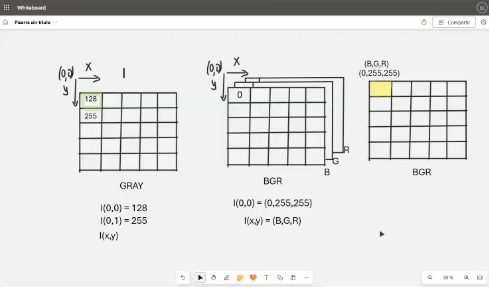
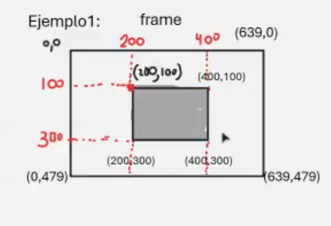
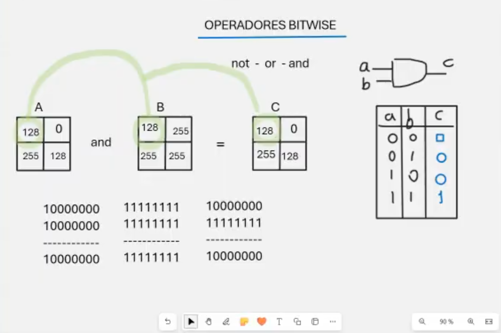
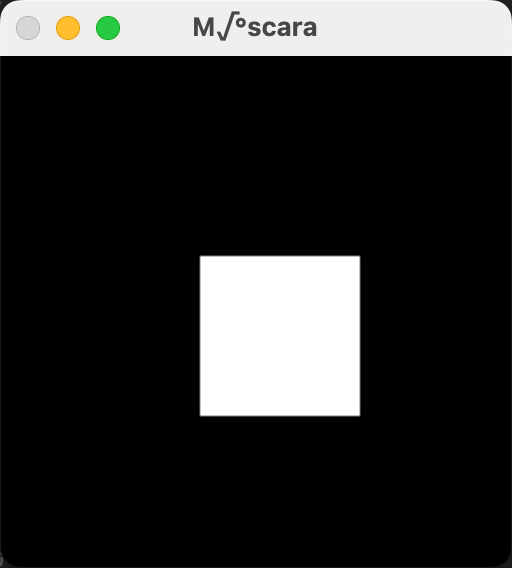
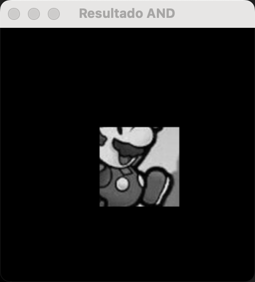
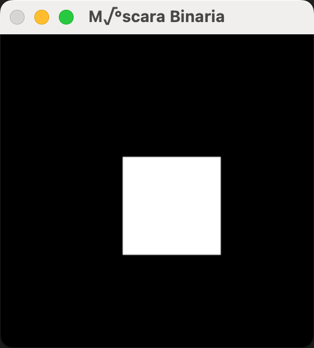
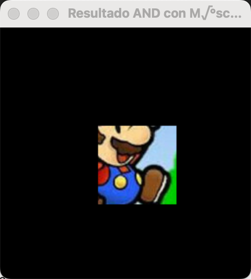

# Clase 23: Espacio de Colores, Operaciones y Bitwise

## 🎨 Introducción

El **Espacio de Colores** define cómo los colores se representan en una imagen digital. Existen diferentes modelos de color, como **RGB**, **HSV** y **CMYK**, cada uno con su propósito y aplicación.

Además, en la manipulación de imágenes, se pueden realizar diversas **operaciones** como ajustes de brillo, contraste y filtros.  
Por otro lado, las **operaciones bitwise** permiten realizar manipulaciones a nivel de bits en una imagen, útiles para segmentación y enmascaramiento.




---

## 📌 Espacios de Color

### 🌈 1. Modelo RGB (Red, Green, Blue)

El modelo **RGB** es aditivo, lo que significa que los colores se forman combinando luz roja, verde y azul en diferentes intensidades.

```python
import cv2
import numpy as np

img = cv2.imread("imagen.jpg")  # Cargar imagen en BGR
rgb_img = cv2.cvtColor(img, cv2.COLOR_BGR2RGB)  # Convertir a RGB
```

---

### 🎨 2. Modelo HSV (Hue, Saturation, Value)

El modelo **HSV** es útil para la segmentación de colores, ya que separa el tono, la saturación y el brillo.

```python
hsv_img = cv2.cvtColor(img, cv2.COLOR_BGR2HSV)
```

---

## 🔧 Operaciones en Imágenes

Las operaciones de manipulación de imágenes incluyen **ajustes de brillo, contraste, inversión de colores y filtros**.

### 📌 Ajuste de Brillo y Contraste

```python
alpha = 1.5  # Contraste
beta = 50    # Brillo

ajustada = cv2.convertScaleAbs(img, alpha=alpha, beta=beta)
```

---

## 🧮 Operaciones Bitwise

Las operaciones **bitwise** permiten combinar imágenes o aplicar máscaras mediante operaciones lógicas a nivel de bits.

### 🔹 `bitwise_and()`

```python
import cv2
import numpy as np

# Definir la primera matriz A (2x2)
A = np.array([
    [128, 0],
    [255, 128]
], dtype=np.uint8)

# Definir la segunda matriz B (2x2)
B = np.array([
    [128, 125],
    [255, 255]
], dtype=np.uint8)

# Aplicar la operación bitwise AND entre A y B
C = cv2.bitwise_and(A, B)

# Imprimir matrices y resultado
print("Matriz A:")
print(A)

print("\nMatriz B:")
print(B)

print("\nResultado de A AND B:")
print(C)

```



---

## 🎮 Proyectos

En estos proyectos se combinarán los conceptos de **espacios de color, operaciones de imagen y bitwise** para segmentar objetos en una imagen.

```python
import cv2
import numpy as np

# Cargar la imagen en escala de grises
image = cv2.imread("images/mario_bros.jpg", 0)

# Verificar si la imagen se cargó correctamente
if image is None:
    print("Error: No se pudo cargar la imagen. Verifique la ruta del archivo.")
    exit()

# Crear una matriz de ceros del mismo tamaño que la imagen
zeros = np.zeros(image.shape, dtype=np.uint8)

# Establecer una región específica en blanco (255) dentro de la matriz de ceros
zeros[100:180, 100:180] = 255  # Región blanca en la máscara

# Aplicar operación bitwise AND entre la imagen y la máscara de ceros
bitwise_and_result = cv2.bitwise_and(image, zeros)

# Mostrar las imágenes en ventanas separadas
cv2.imshow("Imagen Original", image)
cv2.imshow("Máscara", zeros)
cv2.imshow("Resultado AND", bitwise_and_result)

# Imprimir información sobre la imagen
print("Dimensiones de la imagen:", image.shape)
print("Tipo de datos:", image.dtype)
print("Número de dimensiones:", image.ndim)

# Esperar a que el usuario presione una tecla y cerrar ventanas
cv2.waitKey(0)
cv2.destroyAllWindows()
```





---

```python
import cv2
import numpy as np

# Cargar la imagen en color
imagen = cv2.imread("images/mario_bros.jpg", 1)

# Validar que la imagen se cargó correctamente
if imagen is None:
    print("Error: No se pudo cargar la imagen. Verifica la ruta.")
    exit()

# Crear una matriz de ceros (máscara binaria)
altura, ancho = imagen.shape[:2]  # Obtener dimensiones de la imagen
mascara = np.zeros((altura, ancho), dtype=np.uint8)  # Máscara del tamaño de la imagen

# Definir una región blanca en la máscara
mascara[100:180, 100:180] = 255  # Solo esta zona permitirá ver la imagen

# Aplicar la operación bitwise AND usando la máscara
resultado = cv2.bitwise_and(imagen, imagen, mask=mascara)

# Mostrar las imágenes
cv2.imshow("Imagen Original", imagen)
cv2.imshow("Máscara Binaria", mascara)
cv2.imshow("Resultado AND con Máscara", resultado)

# Imprimir detalles de la imagen
print(f"Dimensiones de la imagen: {imagen.shape}")
print(f"Tipo de datos: {imagen.dtype}")
print(f"Número de dimensiones: {imagen.ndim}")

# Esperar una tecla y cerrar ventanas
cv2.waitKey(0)
cv2.destroyAllWindows()
```





## 📌 Conclusión

El conocimiento de los **espacios de color, operaciones de imagen y técnicas bitwise** es fundamental para el procesamiento de imágenes en aplicaciones como **visión por computadora**.

---

## 👨‍💻 Sobre el Autor

- **👤 Nombre:** Edwin Yoner  
- **📧 Contacto:** [✉ edwinyoner@gmail.com](mailto:edwinyoner@gmail.com)  
- **🔗 LinkedIn:** [🌐 linkedin.com/in/edwinyoner](https://www.linkedin.com/in/edwinyoner)