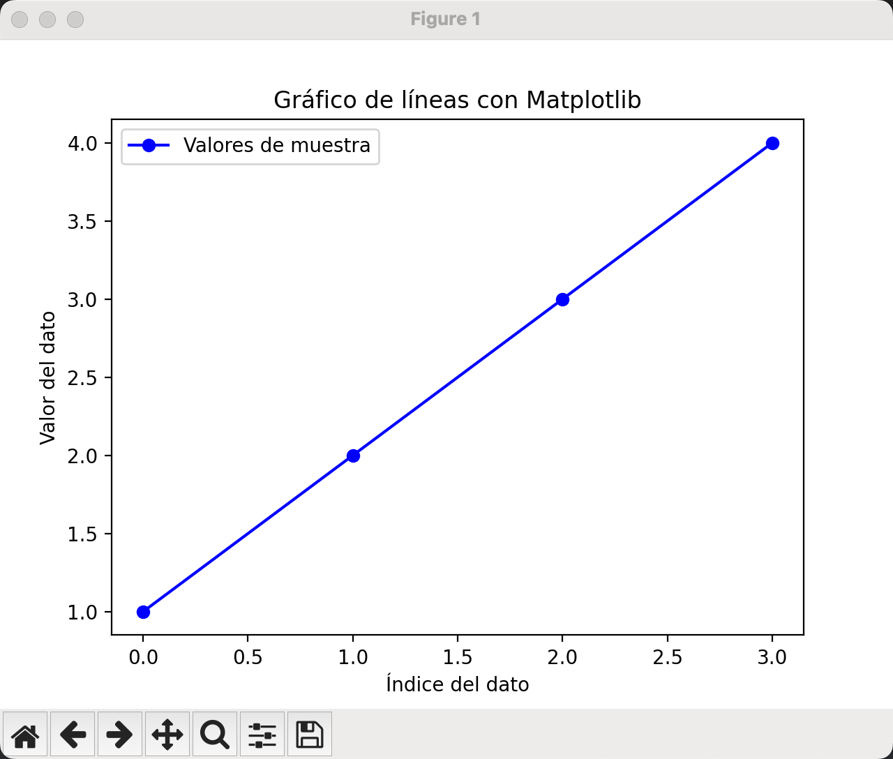
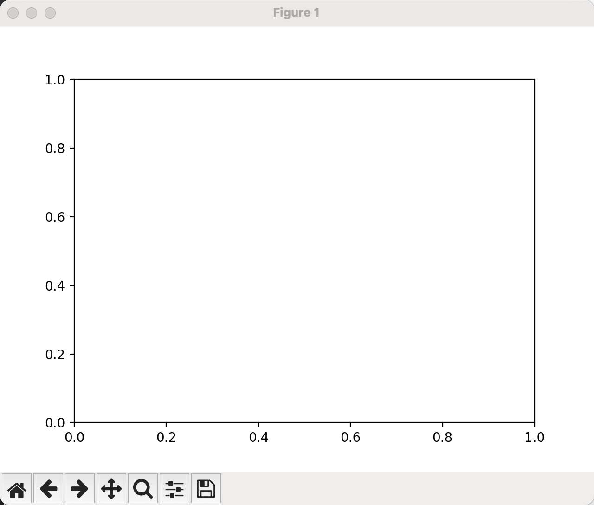
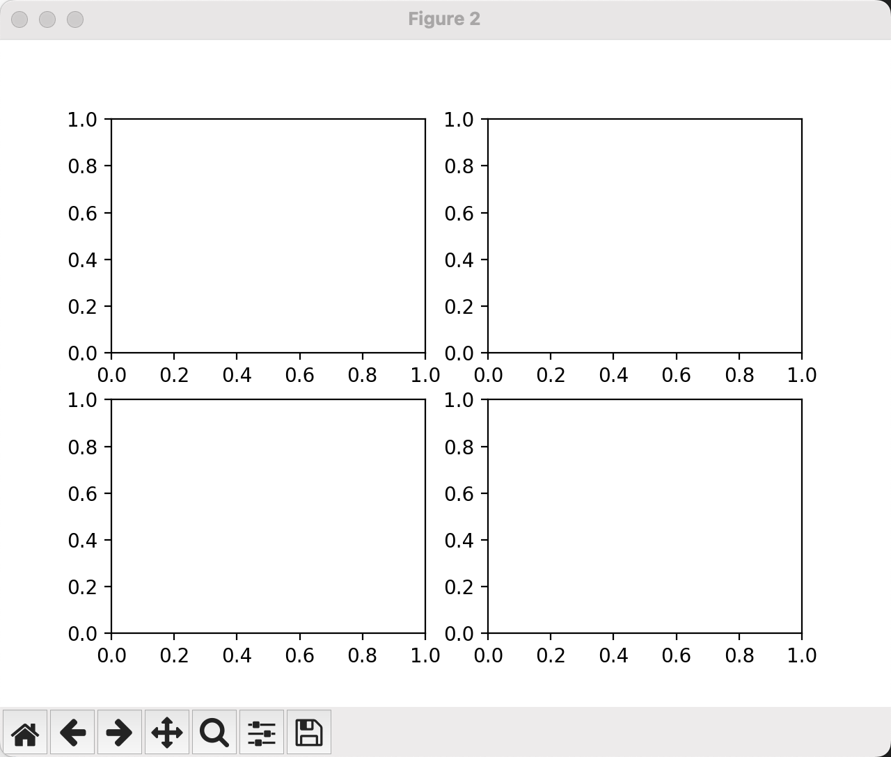
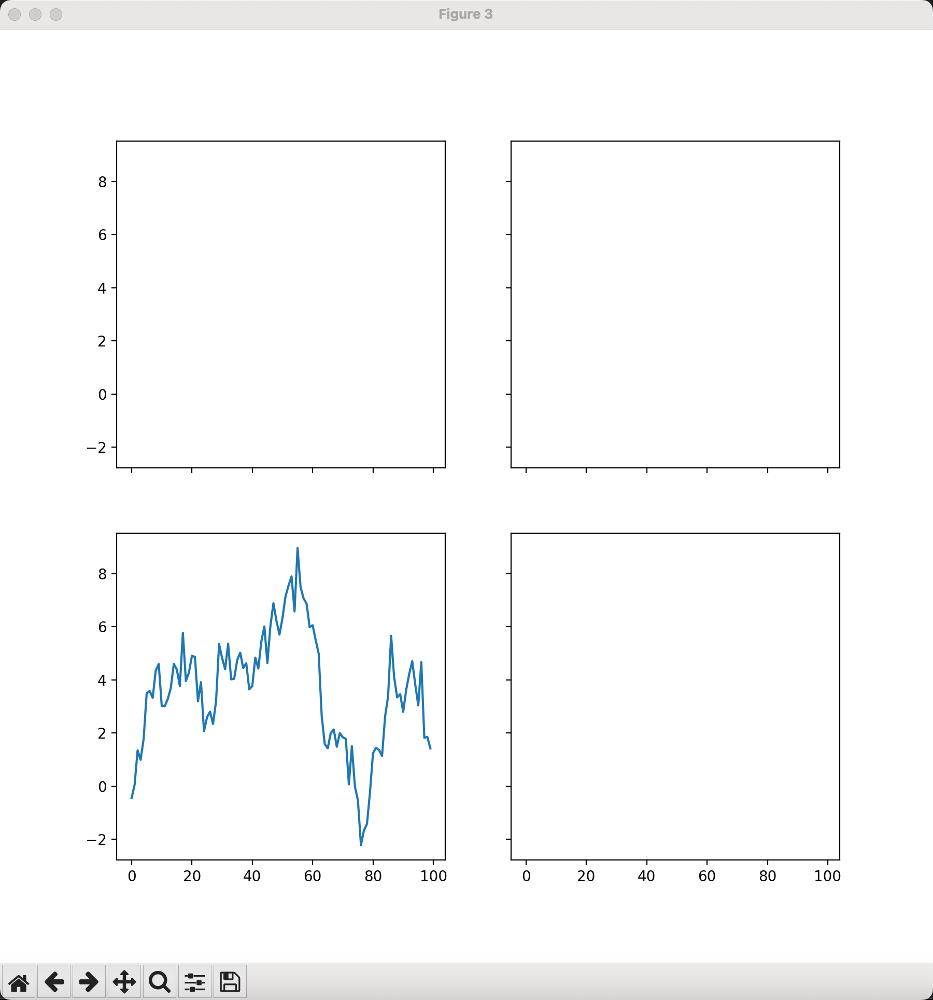
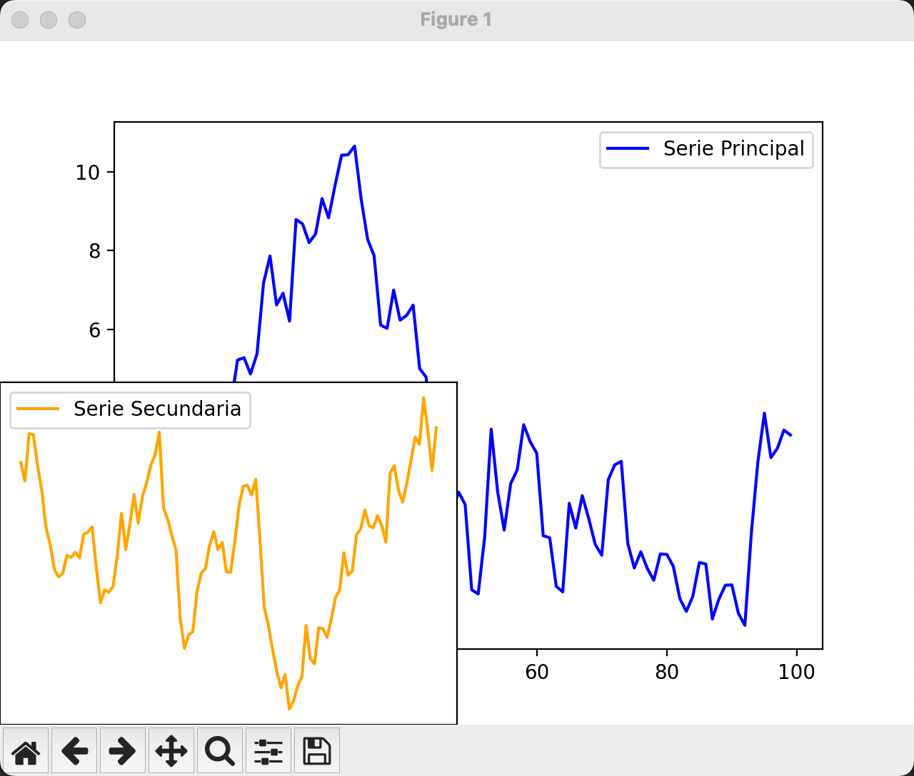
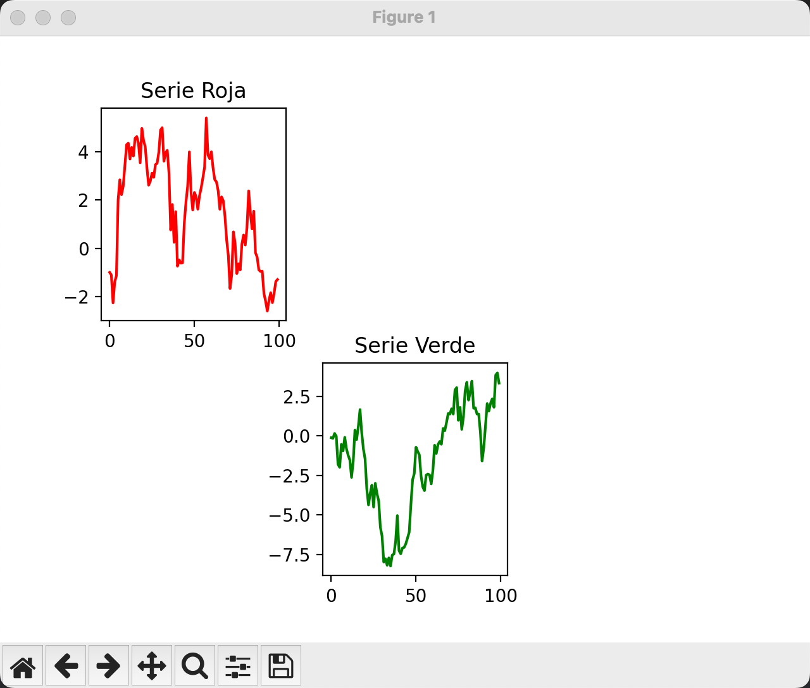
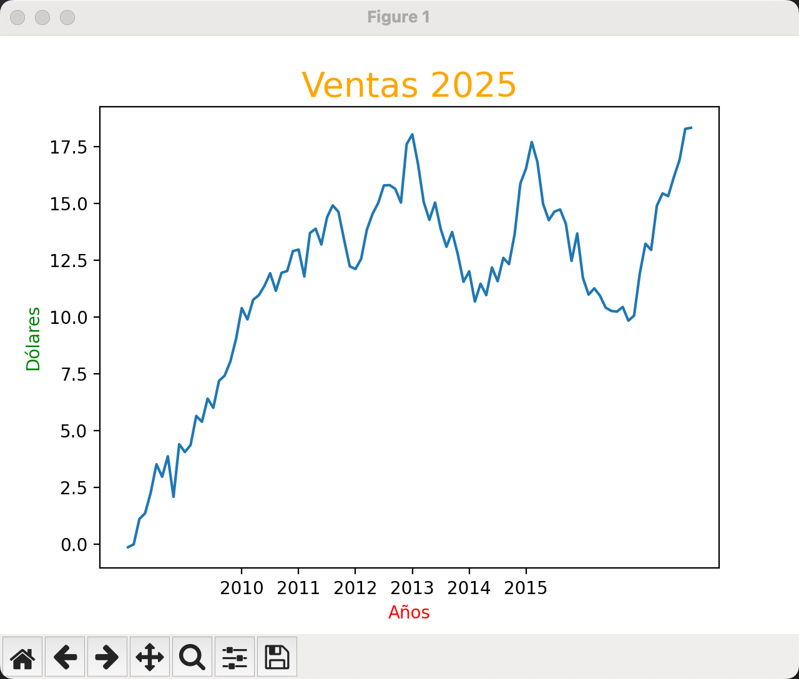
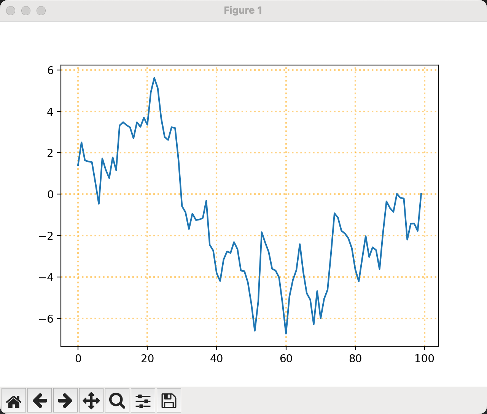
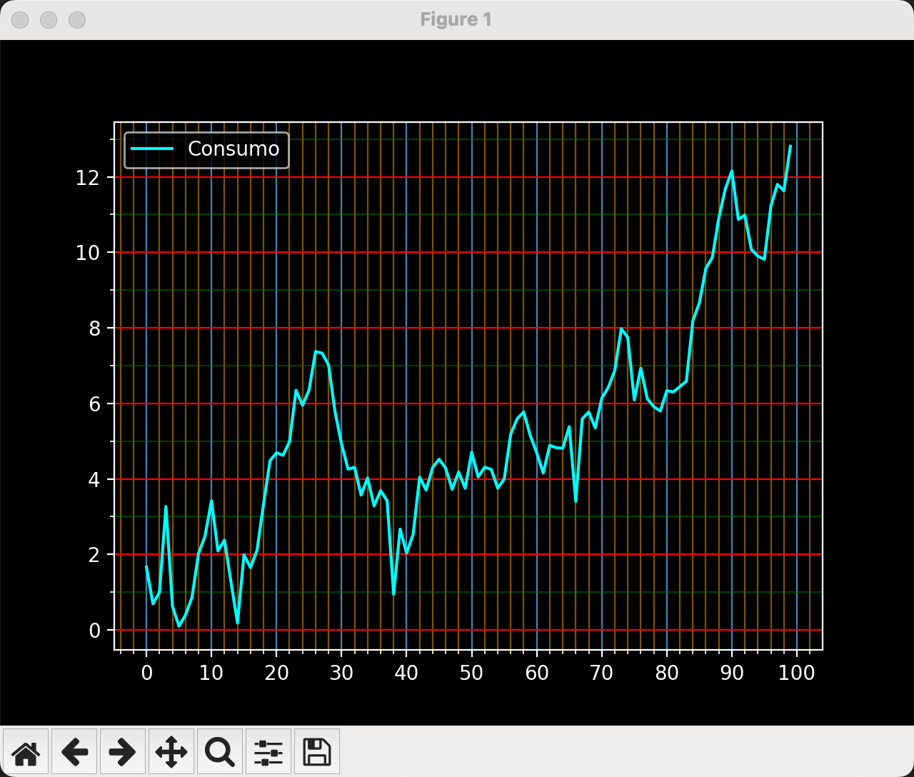

# Clase 24: Matplotlib

## Introducción a Matplotlib
Matplotlib es una de las bibliotecas más utilizadas en Python para la generación de gráficos en 2D. Permite crear visualizaciones de datos de manera sencilla y flexible. Su módulo principal es `pyplot`, el cual proporciona una interfaz similar a MATLAB para generar gráficos con facilidad.

### Instalación
Si aún no tienes instalada la biblioteca, puedes hacerlo con el siguiente comando:
```bash
   pip install matplotlib
```

### Conceptos Claves de Matplotlib
- **Figura (`figure`)**: Es el contenedor principal donde se incluyen los gráficos.
- **Ejes (`axes`)**: Representan un área en la figura donde se dibuja un gráfico.
- **Líneas (`plot`)**: Se utilizan para graficar curvas o datos discretos.
- **Etiquetas (`labels`)**: Sirven para añadir títulos y nombres a los ejes.
- **Leyendas (`legend`)**: Permiten identificar diferentes elementos en un gráfico.
- **Colores y Estilos**: Se pueden personalizar las líneas, colores y estilos para mejorar la presentación de los datos.

---

## Códigos Explicados
A continuación, se describen los 7 códigos utilizados en esta clase:

### 1. Gráfico Simple Matplotlib
Este script genera un gráfico de líneas simple utilizando Matplotlib. Se define una serie de valores en el eje Y y se representan en un gráfico con etiquetas y una leyenda.

```python
# Importamos Matplotlib y su módulo pyplot para la visualización de gráficos
import matplotlib
import matplotlib.pyplot as plt

# Imprimimos la versión de Matplotlib instalada
print(f"Versión de Matplotlib: {matplotlib.__version__}")

# Definir los valores del eje Y
valores_y = [1, 2, 3, 4]

# Crear el gráfico de líneas
plt.plot(valores_y, marker='o', linestyle='-', color='b', label="Valores de muestra")

# Configurar etiquetas de los ejes
plt.xlabel("Índice del dato")
plt.ylabel("Valor del dato")

# Agregar un título al gráfico
plt.title("Gráfico de líneas con Matplotlib")

# Mostrar la leyenda
plt.legend()

# Mostrar el gráfico en pantalla
plt.show()
```


### 2. Gráficos Subplots
Este script genera múltiples gráficos en una cuadrícula utilizando Matplotlib. Se crean diferentes configuraciones de subgráficos (`subplots`) y se visualiza una serie de datos generada aleatoriamente.

```python
# Importar las bibliotecas necesarias
import matplotlib.pyplot as plt
import numpy as np

# Generar una serie de datos aleatorios acumulativos
datos_acumulativos = np.random.randn(100).cumsum()

# Crear una figura con un solo subgráfico
figura, ejes = plt.subplots()

# Crear una figura con una cuadrícula de 2x2 subgráficos
figura, ejes = plt.subplots(2, 2)

# Crear una figura con una cuadrícula de 2x2 subgráficos compartiendo ejes X e Y
figura, ejes = plt.subplots(2, 2, sharex=True, sharey=True)

# Ajustar el tamaño de la figura
figura.set_size_inches(9, 9)

# Imprimir información sobre la figura y los ejes
print(figura, ejes)

# Graficar los datos en el subgráfico ubicado en la posición (1,0)
ejes[1, 0].plot(datos_acumulativos)

# Mostrar los gráficos
plt.show()
```




### 3. Subgráficos Personalizados
Este script genera dos gráficos en la misma figura utilizando Matplotlib. Se usa `plt.axes()` para posicionar manualmente un gráfico dentro de otro.

```python
# Importar las bibliotecas necesarias
import matplotlib.pyplot as plt
import numpy as np

# Generar dos series de datos aleatorios acumulativos
serie_principal = np.random.randn(100).cumsum()
serie_secundaria = np.random.randn(100).cumsum()

# Crear una figura principal
figura = plt.figure()

# Crear el primer eje (gráfico principal)
eje_principal = plt.axes()
eje_principal.plot(serie_principal, label="Serie Principal", color="blue")
eje_principal.legend()

# Crear un segundo eje (gráfico superpuesto en una posición específica)
eje_secundario = plt.axes([0, 0, 0.5, 0.5])  # [x, y, ancho, alto] en coordenadas normalizadas
eje_secundario.plot(serie_secundaria, label="Serie Secundaria", color="orange")
eje_secundario.legend()

# Mostrar los gráficos
plt.show()
```


### 4. Subgráficos Distribuidos
Este script genera una figura con subgráficos distribuidos en una cuadrícula de 2x3 utilizando `fig.add_subplot()`. Cada subgráfico muestra una serie de datos aleatorios acumulativos.

```python
# Importar las bibliotecas necesarias
import matplotlib.pyplot as plt
import numpy as np

# Generar tres series de datos aleatorios acumulativos
serie_verde = np.random.randn(100).cumsum()
serie_roja = np.random.randn(100).cumsum()
serie_azul = np.random.randn(100).cumsum()  # No se usa, pero puede agregarse en otro subplot

# Crear la figura principal
figura = plt.figure()

# Agregar el primer subgráfico en la posición (2,3,5)
subplot_verde = figura.add_subplot(2, 3, 5)
subplot_verde.plot(serie_verde, color="green")
subplot_verde.set_title("Serie Verde")

# Agregar el segundo subgráfico en la posición (2,3,1)
subplot_rojo = figura.add_subplot(2, 3, 1)
subplot_rojo.plot(serie_roja, color="red")
subplot_rojo.set_title("Serie Roja")

# Mostrar los gráficos
plt.show()
```


### 5. Gráfico Ventas
Este script genera un gráfico de línea que representa las ventas proyectadas para el año 2025. Se personalizan los títulos, etiquetas de ejes y los valores del eje X con etiquetas de años.

```python
# Importar bibliotecas necesarias
import matplotlib.pyplot as plt
import numpy as np

# Definir valores del eje X (rango de 100 a 200)
eje_x = range(100, 200)

# Generar valores aleatorios acumulativos para el eje Y
ventas_acumuladas = np.random.randn(100).cumsum()

# Definir etiquetas para los valores del eje X (años)
etiquetas_x = ["2010", "2011", "2012", "2013", "2014", "2015"]

# Crear la figura y los ejes
figura, eje = plt.subplots()

# Graficar la serie de datos
eje.plot(eje_x, ventas_acumuladas)

# Personalizar título y etiquetas de los ejes
eje.set_title("Ventas 2025", fontsize=20, color="orange")
eje.set_xlabel("Años", color="red")
eje.set_ylabel("Dólares", color="green")

# Personalizar las etiquetas del eje X
eje.set_xticks(range(120, 180, 10))  # Definir la posición de las marcas en el eje X
eje.set_xticklabels(etiquetas_x)  # Asignar etiquetas personalizadas

# Mostrar la gráfica
plt.show()
```


### 6. Gráfico con Grid
Este script genera un gráfico de línea con una cuadrícula personalizada. Se aplican configuraciones de color, grosor, transparencia y estilo de línea a la cuadrícula.

```python
# Importar bibliotecas necesarias
import matplotlib.pyplot as plt
import numpy as np

# Generar valores aleatorios acumulativos para el eje Y
datos_y = np.random.randn(100).cumsum()

# Definir etiquetas para el eje X (años)
etiquetas_x = ["2010", "2011", "2012", "2013", "2014", "2015"]

# Crear la figura y los ejes
figura, eje = plt.subplots()

# Graficar la serie de datos
eje.plot(datos_y)

# Personalizar la cuadrícula del gráfico
eje.grid(color="orange",      # Color de las líneas de la cuadrícula
         linewidth=1.5,       # Grosor de las líneas
         alpha=0.5,           # Transparencia de la cuadrícula
         linestyle='dotted')  # Estilo de línea punteado

# Mostrar la gráfica
plt.show()
```


### 7. Gráfico con Múltiples Grid
Este script genera un gráfico de línea con una cuadrícula personalizada en un fondo oscuro. Se configuran diferentes estilos de cuadrícula para los ejes X e Y, diferenciando entre líneas principales y secundarias.

```python
# Importar bibliotecas necesarias
import matplotlib.pyplot as plt
from matplotlib.ticker import MultipleLocator
import numpy as np

# Generar datos aleatorios acumulativos para el eje Y
datos_y = np.random.randn(100).cumsum()

# Definir etiquetas para el eje X (años)
etiquetas_x = ["2010", "2011", "2012", "2013", "2014", "2015"]

# Aplicar estilo de fondo oscuro
plt.style.use('dark_background')

# Crear la figura y los ejes
figura, eje = plt.subplots()

# Graficar la serie de datos
eje.plot(datos_y, label="Consumo", color="cyan")  # Línea de color cyan para mejor visibilidad
eje.legend()  # Mostrar leyenda

# Configuración del eje X
eje.xaxis.set_major_locator(MultipleLocator(10))  # Ubicación de ticks principales cada 10 unidades
eje.xaxis.set_minor_locator(MultipleLocator(2))   # Ubicación de ticks secundarios cada 2 unidades
eje.grid(which="major", axis="x", color="steelblue")  # Cuadrícula principal en azul acero
eje.grid(which="minor", axis="x", color="orange", alpha=0.5)  # Cuadrícula secundaria en naranja con transparencia

# Configuración del eje Y
eje.yaxis.set_major_locator(MultipleLocator(2))  # Ubicación de ticks principales cada 2 unidades
eje.yaxis.set_minor_locator(MultipleLocator(1))  # Ubicación de ticks secundarios cada 1 unidad
eje.grid(which="major", axis="y", color="red")   # Cuadrícula principal en rojo
eje.grid(which="minor", axis="y", color="green", alpha=0.5)  # Cuadrícula secundaria en verde con transparencia

# Mostrar la gráfica
plt.show()
```


---

## Conclusión
Matplotlib es una herramienta poderosa y flexible para la visualización de datos en Python. A través de esta clase, hemos explorado los gráficos más comunes, desde líneas y barras hasta histogramas y gráficos de dispersión. Se puede personalizar aún más los gráficos con colores, estilos y configuraciones avanzadas.

---

## 👨‍💻 Sobre el Autor

- **👤 Nombre:** Edwin Yoner  
- **📧 Contacto:** [✉ edwinyoner@gmail.com](mailto:edwinyoner@gmail.com)  
- **🔗 LinkedIn:** [🌐 linkedin.com/in/edwinyoner](https://www.linkedin.com/in/edwinyoner)