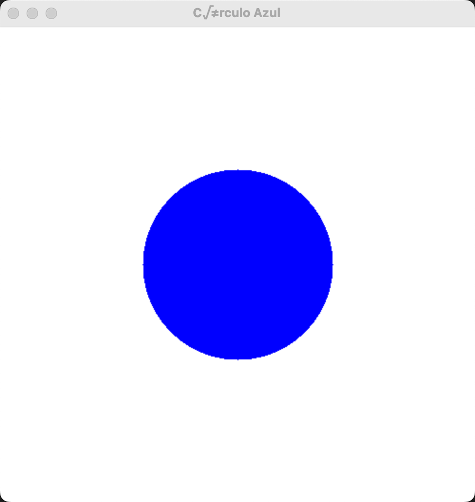
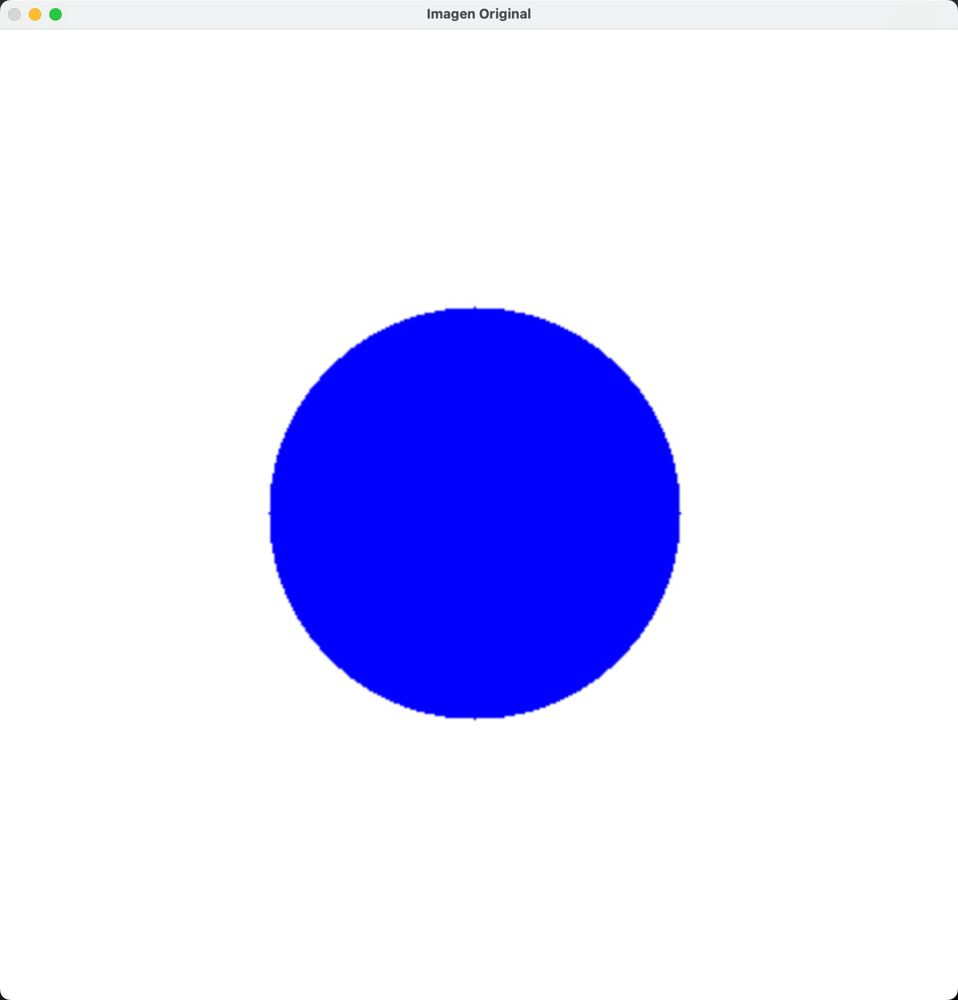
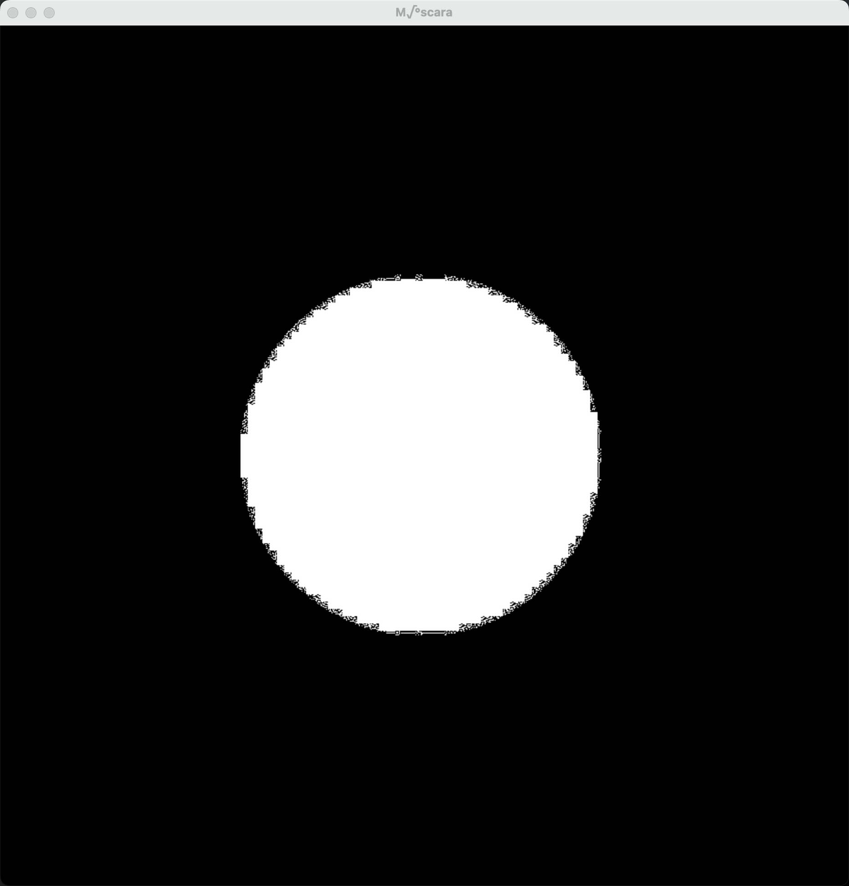
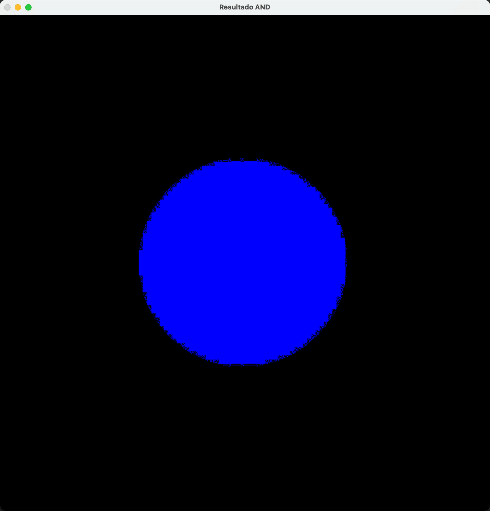
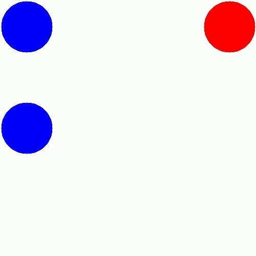
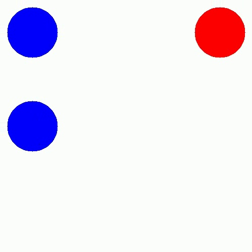
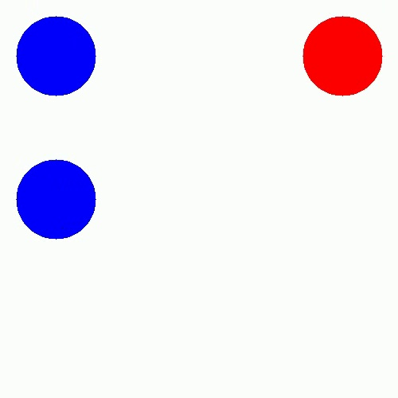

# Clase 25: Procesamiento de Imágenes y Detección de Objetos

## Descripción
En esta clase, exploramos los fundamentos del procesamiento de imágenes y la detección de objetos, dos pilares clave de la visión por computadora. Utilizamos herramientas como OpenCV para analizar imágenes, aplicar técnicas de preprocesamiento y detectar características como bordes, contornos y objetos. Este contenido sienta las bases para aplicaciones avanzadas en diversos campos.

## Códigos Explicados
A continuación, se describen los 7 códigos utilizados en esta clase:

### 1. Dibujar Circulo
Este script crea una imagen en blanco de 500x500 píxeles y dibuja un círculo azul en el centro utilizando OpenCV.

```python
# Importar bibliotecas necesarias
import cv2
import numpy as np

# Mostrar información sobre la función cv2.circle()
help(cv2.circle)

# Crear una imagen en blanco (500x500) con fondo blanco (255,255,255)
imagen = np.ones((500, 500, 3), dtype=np.uint8) * 255

# Definir parámetros del círculo
centro = (250, 250)      # Coordenadas del centro del círculo
radio = 100              # Radio del círculo
color = (255, 0, 0)      # Color azul (en formato BGR)
grosor = -1              # -1 indica que el círculo se rellenará completamente

# Dibujar el círculo en la imagen
cv2.circle(imagen, centro, radio, color, grosor)

# Mostrar la imagen en una ventana
cv2.imshow("Círculo Azul", imagen)

# Esperar a que se presione una tecla antes de cerrar la ventana
cv2.waitKey(0)
cv2.destroyAllWindows()
```


### 2. Filtrar Color
Este script carga una imagen, aplica un filtro de color utilizando OpenCV para generar una máscara basada en un rango de valores RGB, y luego muestra la imagen original, la máscara y el resultado de la operación bitwise AND.

```python
# Importar bibliotecas necesarias
import cv2
import numpy as np

# Definir el rango de colores a filtrar en formato BGR
color_min = np.array([100, 0, 0])  # Azul mínimo
color_max = np.array([254, 0, 0])  # Azul máximo

# Cargar la imagen
imagen = cv2.imread("images/circulo.jpg")

# Verificar si la imagen se cargó correctamente
if imagen is None:
    print("Error: No se pudo cargar la imagen. Verifica la ruta.")
    exit()

# Aplicar un filtro para obtener una máscara con los colores en el rango especificado
mascara = cv2.inRange(imagen, color_min, color_max)

# Aplicar la operación bitwise AND para extraer los píxeles dentro del rango de color
resultado = cv2.bitwise_and(imagen, imagen, mask=mascara)

# Mostrar la imagen original, la máscara y el resultado
cv2.imshow("Imagen Original", imagen)
cv2.imshow("Máscara", mascara)
cv2.imshow("Resultado AND", resultado)

# Obtener las dimensiones de la imagen
alto, ancho, canales = imagen.shape

# Imprimir el valor del píxel en el centro de la imagen
pixel_central = imagen[int(alto / 2), int(ancho / 2)]
print(f"Valor del píxel central: {pixel_central}")

# Esperar a que se presione una tecla antes de cerrar las ventanas
cv2.waitKey(0)
cv2.destroyAllWindows()

```




### 3. Detección de Objetos Video
Este script carga un video, convierte cada fotograma a HSV, aplica una máscara para detectar objetos dentro de un rango de color específico y guarda capturas cuando se detectan suficientes píxeles blancos.

```python
# Importar bibliotecas necesarias
import cv2
import numpy as np

# Cargar el video
video = cv2.VideoCapture("video/circles.avi")

# Definir el rango de color en formato HSV (para detectar el objeto)
color_min = np.array([110, 80, 80])   # Mínimo (H, S, V)
color_max = np.array([120, 255, 255]) # Máximo (H, S, V)

# Contador de imágenes guardadas
contador_fotos = 0

# Definir el umbral de detección (cantidad de píxeles blancos necesarios para considerar un objeto detectado)
umbral_pixeles = 15000

# Bucle para procesar cada fotograma del video
while video.isOpened():
    # Leer el siguiente fotograma
    ret, frame = video.read()

    # Verificar si el fotograma se leyó correctamente
    if not ret:
        break

    # Convertir el fotograma de BGR a HSV
    frame_hsv = cv2.cvtColor(frame, cv2.COLOR_BGR2HSV)

    # Crear la máscara de color
    mascara = cv2.inRange(frame_hsv, color_min, color_max)

    # Aplicar la operación bitwise AND para extraer el objeto detectado
    resultado = cv2.bitwise_and(frame, frame, mask=mascara)

    # Contar los píxeles blancos en la máscara
    cantidad_pixeles_blancos = cv2.countNonZero(mascara)

    # Verificar si se detecta el objeto (según el umbral de píxeles blancos)
    if cantidad_pixeles_blancos > umbral_pixeles:
        print("🔹 Objeto Detectado")
        nombre_imagen = f"images/foto{contador_fotos}.jpg"
        cv2.imwrite(nombre_imagen, frame)  # Guardar la imagen del fotograma
        print(f"📷 Imagen guardada: {nombre_imagen}")
        contador_fotos += 1

    # Mostrar los resultados en ventanas
    cv2.imshow("Video Original", frame)
    cv2.imshow("Máscara de Color", mascara)
    cv2.imshow("Detección AND", resultado)

    # Esperar 120 ms entre fotogramas y salir si se presiona la tecla 'a'
    if cv2.waitKey(120) == ord('a'):
        break

# Liberar recursos y cerrar ventanas
video.release()
cv2.destroyAllWindows()
```





## Conclusión
Esta clase introduce herramientas esenciales para el procesamiento de imágenes y la detección de objetos. Estas técnicas son fundamentales para proyectos avanzados como reconocimiento facial, análisis de video en tiempo real o automatización.

---

## 👨‍💻 Sobre el Autor

- **👤 Nombre:** Edwin Yoner  
- **📧 Contacto:** [✉ edwinyoner@gmail.com](mailto:edwinyoner@gmail.com)  
- **🔗 LinkedIn:** [🌐 linkedin.com/in/edwinyoner](https://www.linkedin.com/in/edwinyoner)